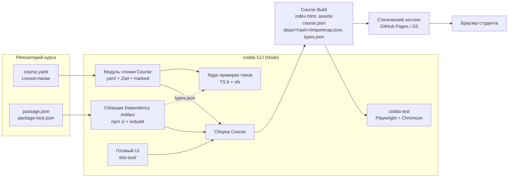
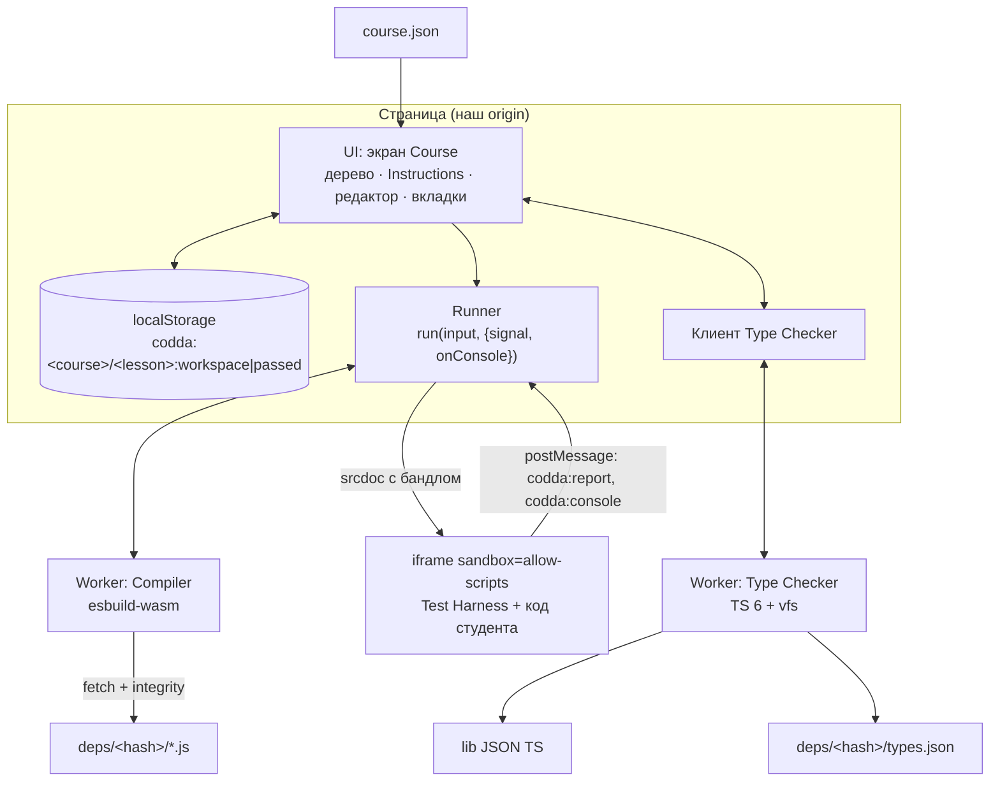
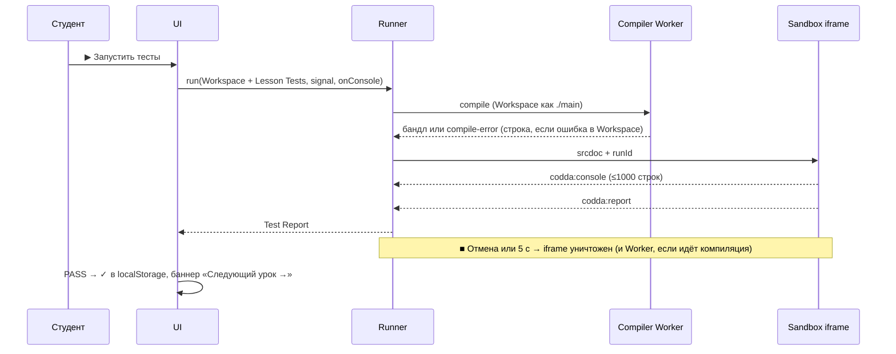
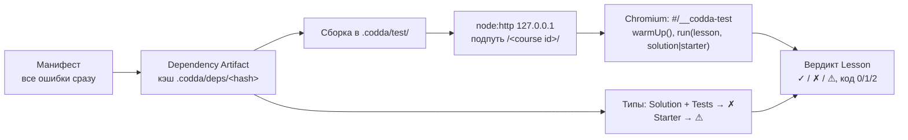

# Результат MVP и как он проверяется

Коротко: что получится после прогона [mvp-autorun](README.md), как устроено и чем доказано. Подробности — в спеках фич `NN-<feature>/spec.md`. Учтены решения раундов 2–3 в [questions/00-mvp-autorun.md](questions/00-mvp-autorun.md): source maps — в «MVP, часть 2» (Q11, Q13), `lesson-manifest/01` разрезан на 01a/01b (Q14), один `npm ci` в CI (Q12).

## 1. Результат

**Студент** (Chrome, адрес пилота `https://dsvgit.github.io/codda/`):

- Курс React Hooks: 1 Module, 5 Lesson. Слева дерево Course с ✓ и «Пройдено N из 5», в центре Instructions (Markdown), справа редактор `main.tsx`.
- `▶ Запустить тесты` ⇄ `■ Отмена`, `↺ Сбросить` (откатывается через Ctrl/Cmd+Z), `Показать решение`.
- Вкладки «Тесты» · «Console» · «Проблемы» · «Решение». Test Report на русском: PASS, FAIL, ошибка компиляции со строкой и подчёркиванием, runtime-ошибка, timeout, отмена, внутренняя ошибка.
- Ошибки типов TS подчёркиваются, autocomplete от TS.
- `← Предыдущий` / `Следующий →`, «Следующий урок →» в баннере PASS, адрес `#/<lesson id>`.
- Код и прогресс сохраняются в `localStorage` и переживают перезагрузку.
- Ни одного запроса за пределы нашего origin.

**Author** (свой Git-репозиторий курса):

- Course — папка: `course.yaml`, папки Lesson (`lesson.md`, `main.ts(x)`, `solution.*`, `lesson.test.*`), `package.json` + `package-lock.json` с зависимостями.
- `npx codda init | lesson | dev | test | build`. Шаблоны CI: `init --ci github|gitlab`.
- `codda test` в полном Chromium проверяет, что Solution проходит тесты, а Starter нет, и проверяет типы. Код выхода `0/1/2`.
- README пакета `codda` — инструкция от `init` до CI.

**Репозиторий:**

- npm workspaces: инструмент в `packages/codda/` (CLI + UI + Runtime), курсы в `courses/` вне workspaces.
- Код инструмента не импортирует `courses/`, это проверяется в CI (ADR-0006).
- CI `check`: тесты инструмента, затем `codda test` + `codda build` по каждому курсу. `deploy` выкладывает на Pages проверенную сборку курса.
- PoC-формат курса, `public/deps/` и `scripts/build-deps.mjs` удалены.

**Не входит:** source maps (строка runtime-ошибки в файле студента), multi-file, hover и auto-import, серверный прогресс, security baseline, Safari/Firefox, пилот на людях (тикет ✋ `pilot-course/03`) и `docs/mvp-report.md`. Список — «MVP, часть 2» в `docs/roadmap.md`.

## 2. Архитектура

### Поток от Author до студента

### Браузер студента

### Один Run

### `codda test`

## 3. Как проверяем

Три уровня, каждый уровень — gate для следующего шага:

| Уровень | Когда | Что | Кто |
|---|---|---|---|
| **Тикет** | каждый коммит | тесты написаны до кода (red → green), ошибки и граничные случаи — в том же тикете; `npm run typecheck`, `npm test`, `npm run test:e2e` зелёные; чекбоксы и `## Comments` тикета | субагент |
| **Фича** | после последнего тикета фичи | `/code-review` по диапазону коммитов фичи: Standards + Spec + правила против оверинжиниринга; правки — коммит `<feature>: правки по review`; `git push`, зелёный CI `check` | оркестратор |
| **MVP** | `pilot-course` | курс React Hooks: `codda test` → 5 ✓, 0 ⚠; сквозной e2e «студент проходит курс»; таблица «Определение MVP → статус → доказательство» в `## Итог` спеки `pilot-course` | субагент, затем человек |

Последний шаг делает человек: смотрит PR, «Журнал допущений» в `README.md` и таблицу `## Итог`, мержит, включает Pages и проводит пилот.

**Правило доказательства:** у каждой строки «сделано» в таблице `## Итог` есть имя теста, e2e-сценарий, коммит или ручная проверка с датой. Только руками проверяются UI на русском, «только Chrome» и закрытый контур на собранном курсе.

## 4. Тесты по швам

| Шов | Инструмент | Что покрывает | Фичи |
|---|---|---|---|
| **CLI как процесс** | Vitest, node-проект; временный курс-фикстура | `codda build/test/dev/init/lesson`: код выхода, stdout/stderr, файлы на диске; ошибки манифеста; сборка артефакта, кэш, npm; проверка типов | lesson-manifest, dependency-artifacts, author-cli, ts-tooling |
| **Runner `run()`** | Vitest browser mode, полный Chromium | Test Report всех видов, `./main`, отмена, console и лимиты, async-ошибки (R8), падение Worker, загрузка артефакта (404, integrity, импорт вне точек входа), подделка `postMessage` | runtime-hardening, dependency-artifacts |
| **Экран Lesson** | Vitest browser mode, литерал `CourseData` | тулбар, вкладки, Test Report на русском, Reset + undo, «Решение», подчёркивание, навигация, `localStorage` с ошибками | lesson-manifest, runtime-hardening, course-ux |
| **e2e на Course Build** | Playwright, фикстура `offline` (любой внешний запрос — провал), подпуть как на Pages | загрузка `course.json`, `#/…`, Instructions, Type Checker (подчёркивания, «Проблемы», autocomplete, отказ загрузки), перезагрузка сохраняет код и ✓, «Назад»/«Вперёд», сквозное прохождение 5 Lesson | все UI-фичи, pilot-course |
| **e2e на `npm run dev`** | Playwright | один smoke: Lesson открывается, Solution даёт PASS | lesson-manifest |
| **Граница ADR-0006** | Node-тест по исходникам + `rootDir` | импорт из `courses/` в коде инструмента (включая `?raw`) — провал | lesson-manifest |
| **Шаблоны CI** | Vitest + `yaml` | GitHub- и GitLab-шаблон: job'ы, порядок `codda`, выкладка только с `main` | author-cli |
| **Курс в CI** | `CI=true npx codda test` + `codda build` по `courses/*` | все Solution проходят, Starter нет, типы чисты | author-cli, ts-tooling, pilot-course |

Тесты проверяют поведение на самом высоком шве: что видит студент, что печатает CLI, что лежит на диске. Внутренние функции (схема, VLQ, hash, обёртки CJS) отдельно не тестируются, кроме чистых функций, где перебор через процесс дорог: вердикт Lesson, модуль отчёта, ядро типов.

## 5. Где смотреть ход работ

- Порядок, договорённости, журнал и допущения — [README.md](README.md).
- Статус каждого тикета — поле `Status:` в `NN-<feature>/issues/*.md`.
- Итоговая таблица MVP — `## Итог` в [07-pilot-course/spec.md](07-pilot-course/spec.md).
